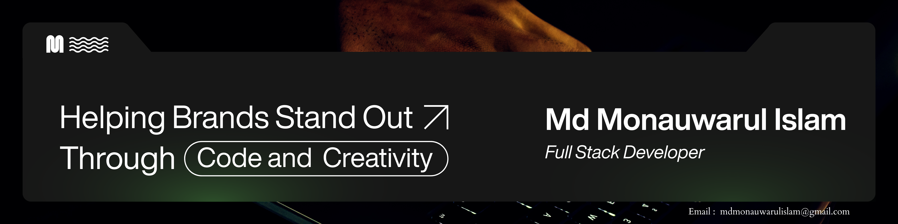

  

<h1 align="center">Hey 👋, I'm Md Monauwarul Islam</h1>

<h3 align="center">🚀 Full Stack Developer | MERN | Next.js | Java | Exploring Tech & Building Impactful Projects</h3>

<h2>👨‍💻 About Me</h2>
<ul>
  <li>🚀 Creating impactful and scalable solutions</li>
  <li>🌱 Currently mastering <b>Full Stack Development, Cloud, and DevOps</b></li>
  <li>🎯 Goal: Build meaningful applications that make a positive impact</li>
  <li>💡 Fun Fact: I enjoy blending creativity & logic to solve challenges</li>
</ul>

<h3>🌐 Portfolio: <a href="https://mmi-portfolio.vercel.app/" target="_blank">mmi-portfolio.vercel.app</a></h3>

<h2>⚡ Tech Stack</h2>

  
  
  
  
  
  
  
  
  
  
  
  
  
  
  
  
  
  
  
  
  

<h2>📊 GitHub Stats</h2>

  
  

  

<h2>📈 Activity Graph</h2>

  

<h2>🌍 Profile Visitors</h2>

  

<h2>🤝 Connect With Me</h2>

  
  
  
  
  

